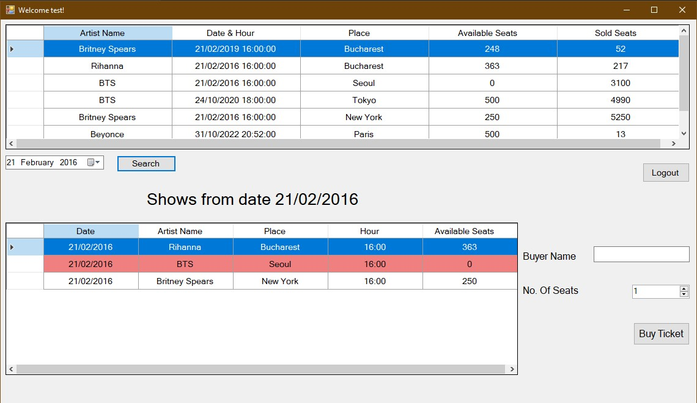

<!-- Improved compatibility of back to top link: See: https://github.com/othneildrew/Best-README-Template/pull/73 -->
<a name="readme-top"></a>
<!--
*** Thanks for checking out the Best-README-Template. If you have a suggestion
*** that would make this better, please fork the repo and create a pull request
*** or simply open an issue with the tag "enhancement".
*** Don't forget to give the project a star!
*** Thanks again! Now go create something AMAZING! :D
-->


<!-- PROJECT SHIELDS -->
<!--
*** I'm using markdown "reference style" links for readability.
*** Reference links are enclosed in brackets [ ] instead of parentheses ( ).
*** See the bottom of this document for the declaration of the reference variables
*** for contributors-url, forks-url, etc. This is an optional, concise syntax you may use.
*** https://www.markdownguide.org/basic-syntax/#reference-style-links
-->

<!--[![Contributors][contributors-shield]][contributors-url]
[![Forks][forks-shield]][forks-url]
[![Stargazers][stars-shield]][stars-url] 
[![Issues][issues-shield]][issues-url] -->
[![License][license-shield]][license-url]
[![LinkedIn][linkedin-shield]][linkedin-url]


<!--
 PROJECT LOGO
<br />
<div align="center">
  <a href="https://github.com/claudiamunteanu/product-management">
    
  </a>
-->
# Ticket Store
Simple client-server desktop application for a ticket store. This is the .NET version of a project created for the "Systems for Design and Implementation" course at my university from my second year.
  <!--
  <p align="center">
    Simple CRUD mobile application for the management of a store's products, created for the "Mobile Application Programming" course at my university.
    <br />
    <a href="https://github.com/claudiamunteanu/product-management"><strong>Explore the docs »</strong></a>
    <br />
    <br />
    <a href="https://github.com/claudiamunteanu/product-management">View Demo</a>
    ·
    <a href="https://github.com/claudiamunteanu/product-management/issues">Report Bug</a>
    ·
    <a href="https://github.com/claudiamunteanu/product-management/issues">Request Feature</a>
  </p>
</div>
-->


<!-- TABLE OF CONTENTS -->
<details>
  <summary>Table of Contents</summary>
  <ol>
    <li>
      <a href="#about-the-project">About The Project</a>
      <ul>
        <li><a href="#built-with">Built With</a></li>
      </ul>
    </li>
    <li>
      <a href="#getting-started">Getting Started</a>
      <ul>
        <li><a href="#prerequisites">Prerequisites</a></li>
        <li><a href="#setup-and-build">Setup and Build</a></li>
        <li><a href="#running">Running</a></li>
      </ul>
    </li>
    <!--
    <li><a href="#usage">Usage</a></li>
    <li><a href="#roadmap">Roadmap</a></li>
    <li><a href="#contributing">Contributing</a></li>
    -->
    <li><a href="#license">License</a></li>
    <li><a href="#contact">Contact</a></li>
    <!--<li><a href="#acknowledgments">Acknowledgments</a></li>-->
  </ol>
</details>

<!-- ABOUT THE PROJECT -->
## About The Project



The user creates an account if he doesn't have one and then logs into it. There, he can view a list of all of the shows, he can filter them by date and he can buy tickets for one of those filtered shows.

The project also contains a simple REST client, which requires the REST server from the Java version of this project, which you can find [here](https://github.com/claudiamunteanu/shows-ticket-store-csharp)

<p align="right">(<a href="#readme-top">back to top</a>)</p>

### Built With
* [![SQLite][SQLite.org]][SQLite-url]
* [![.Net][.Net.com]][.Net-url]
* [![Rider][Rider.com]][Rider-url]
* ![C#][C#.com]
<p align="right">(<a href="#readme-top">back to top</a>)</p>


<!-- GETTING STARTED -->
## Getting Started

To get a local copy up and running follow these simple steps.

### Prerequisites

* [Rider][Rider-url]
* [.Net][.Net-url]
* [SQLite][SQLite-url]
* [SQLite Studio](https://sqlitestudio.pl/)

### Setup and build

* Clone the repo
   ```sh
   git clone https://github.com/claudiamunteanu/shows-tickets-store-java.git
   ```
   
### Running

To run the project on your computer:
1. Deploy and run the `server` module
2. Deploy and run the `client` module.

To run the REST client:
* Deploy and run the `RestClient` module

If you wish, you can modify the database at any time using SQLite Studio, where you can manage the shows, the users or the tickets.

<p align="right">(<a href="#readme-top">back to top</a>)</p>


<!-- USAGE EXAMPLES -->
<!--## Usage

Use this space to show useful examples of how a project can be used. Additional screenshots, code examples and demos work well in this space. You may also link to more resources.

_For more examples, please refer to the [Documentation](https://example.com)_

<p align="right">(<a href="#readme-top">back to top</a>)</p>
-->


<!-- CONTRIBUTING -->
<!--
## Contributing

Contributions are what make the open source community such an amazing place to learn, inspire, and create. Any contributions you make are **greatly appreciated**.

If you have a suggestion that would make this better, please fork the repo and create a pull request. You can also simply open an issue with the tag "enhancement".
Don't forget to give the project a star! Thanks again!

1. Fork the Project
2. Create your Feature Branch (`git checkout -b feature/AmazingFeature`)
3. Commit your Changes (`git commit -m 'Add some AmazingFeature'`)
4. Push to the Branch (`git push origin feature/AmazingFeature`)
5. Open a Pull Request

<p align="right">(<a href="#readme-top">back to top</a>)</p>
-->


<!-- LICENSE -->
## License

Distributed under the MIT License. See `LICENSE.txt` for more information.

<p align="right">(<a href="#readme-top">back to top</a>)</p>


<!-- CONTACT -->
## Contact

Munteanu Claudia-Maria - Linkedin: [claudiamunteanu][linkedin-url]

Project Link: [https://github.com/claudiamunteanu/shows-tickets-store-csharp](https://github.com/claudiamunteanu/shows-tickets-store-csharp)

<p align="right">(<a href="#readme-top">back to top</a>)</p>


<!-- ACKNOWLEDGMENTS -->
<!--## Acknowledgments

* []()
* []()
* []()

<p align="right">(<a href="#readme-top">back to top</a>)</p>

-->

<!-- MARKDOWN LINKS & IMAGES -->
<!-- https://www.markdownguide.org/basic-syntax/#reference-style-links -->
[contributors-shield]: https://img.shields.io/github/contributors/claudiamunteanu/shows-ticket-store-csharp.svg?style=for-the-badge
[contributors-url]: https://github.com/claudiamunteanu/shows-ticket-store-csharp/graphs/contributors
[forks-shield]: https://img.shields.io/github/forks/claudiamunteanu/shows-ticket-store-csharp.svg?style=for-the-badge
[forks-url]: https://github.com/claudiamunteanu/shows-ticket-store-csharp/network/members
[stars-shield]: https://img.shields.io/github/stars/claudiamunteanu/shows-ticket-store-csharp.svg?style=for-the-badge
[stars-url]: https://github.com/claudiamunteanu/shows-ticket-store-csharp/stargazers
[issues-shield]: https://img.shields.io/github/issues/claudiamunteanu/shows-ticket-store-csharp.svg?style=for-the-badge
[issues-url]: https://github.com/claudiamunteanu/shows-ticket-store-csharp/issues
[license-shield]: https://img.shields.io/github/license/claudiamunteanu/shows-ticket-store-csharp.svg?style=for-the-badge
[license-url]: https://github.com/claudiamunteanu/shows-ticket-store-csharp/blob/master/LICENSE
[linkedin-shield]: https://img.shields.io/badge/-LinkedIn-black.svg?style=for-the-badge&logo=linkedin&colorB=555
[linkedin-url]: https://linkedin.com/in/claudiamunteanu
[SQLite.org]: https://img.shields.io/badge/sqlite-%2307405e.svg?style=for-the-badge&logo=sqlite&logoColor=white
[SQLite-url]: https://www.sqlite.org/index.html
[.Net.com]: https://img.shields.io/badge/.NET-5C2D91?style=for-the-badge&logo=.net&logoColor=white
[.Net-url]: https://dotnet.microsoft.com/en-us/
[Rider.com]: https://img.shields.io/badge/Rider-000000.svg?style=for-the-badge&logo=Rider&logoColor=white&color=black&labelColor=crimson
[Rider-url]: https://www.jetbrains.com/rider/
[C#.com]: https://img.shields.io/badge/c%23-%23239120.svg?style=for-the-badge&logo=c-sharp&logoColor=white
